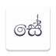

<!--
*** Thanks for checking out the Best-README-Template. If you have a suggestion
*** that would make this better, please fork the repo and create a pull request
*** or simply open an issue with the tag "enhancement".
*** Thanks again! Now go create something AMAZING! :D
-->

<!-- PROJECT SHIELDS -->
<!--
*** I'm using markdown "reference style" links for readability.
*** Reference links are enclosed in brackets [ ] instead of parentheses ( ).
*** See the bottom of this document for the declaration of the reference variables
*** for contributors-url, forks-url, etc. This is an optional, concise syntax you may use.
*** https://www.markdownguide.org/basic-syntax/#reference-style-links
-->

<!-- PROJECT LOGO -->
 

    

  <h1 align="center">Sesatha Mobile Application </h1>

  

    Project overview and installation instructions
     
    <a href="https://github.com/othneildrew/Best-README-Template"><strong>Explore the docs »</strong></a>
     
     
    <a href="https://www.linkedin.com/posts/paramilelkada_activity-6797224135505272832-Iluf">View Demo</a>
    ·
    <a href="https://github.com/othneildrew/Best-README-Template/issues">Report Bug</a>
    ·
    <a href="https://github.com/othneildrew/Best-README-Template/issues">Request Feature</a>
  

<!-- TABLE OF CONTENTS -->

  
Table of Contents

  <ol>
    <li>
      <a href="#about-the-project">About The Project</a>
      <ul>
        <li><a href="#built-with">Built With</a></li>
      </ul>
    </li>
    <li><a href="#usage">Usage</a></li>
    <li><a href="#interfaces">Interfaces</a></li>
    <li><a href="#license">License</a></li>
    <li><a href="#acknowledgements">Acknowledgements</a></li>
    <li><a href="#contributors">Contributors</a></li>
  </ol>

<!-- ABOUT THE PROJECT -->
## About The Project

<!--[![Product Name Screen Shot][product-screenshot]](https://example.com)-->

### Built With

This section shows the list of major frameworks that we have used to  built our project . 
* Developed with : [Java 8](https://www.java.com/)

* Database : [Firebase](https://firebase.google.com/)

### Compatibility

This app has been tested on android platforms above Android Pie(API 28).

## Usage

Use this space to show useful examples of how a project is implemented. Additional screenshots, code examples and demos work well in this space. You may also link to more resources.

For more examples, please refer to the [Documentation](https://example.com)_

## Interfaces
    &nbsp;   

          

## License

Distributed under the MIT License. See `LICENSE` for more information.

<!-- CONTACT 
## Contact

Your Name - [@your_twitter](https://twitter.com/your_username) - email@example.com

Project Link: [https://github.com/salukadev/Pharmac-OMS.git](https://github.com/salukadev/Pharmac-OMS.git)
-->

<!-- ACKNOWLEDGEMENTS  -->
## Acknowledgements

This is a project done for the Mobile Application Development module of BSc.(Hons.) Degree in Information Technology in Sri Lanka Institute of Information Technology

## Contributors
* IT19001708 - Parami Lelkada - [pLe98](https://github.com/pLe98)
* IT19188928 - Saluka Udbhasa - [salukadev](https://github.com/salukadev)
* IT19987880 - Manoj Rangana - [RanganaPWM](https://github.com/RanganaPWM)
* IT19955896 - Ridma Reshan - [ridma11](https://github.com/ridma11)

<!-- MARKDOWN LINKS & IMAGES -->
<!-- https://www.markdownguide.org/basic-syntax/#reference-style-links -->
[contributors-shield]: https://img.shields.io/github/contributors/othneildrew/Best-README-Template.svg?style=for-the-badge
[contributors-url]: https://github.com/othneildrew/Best-README-Template/graphs/contributors
[forks-shield]: https://img.shields.io/github/forks/othneildrew/Best-README-Template.svg?style=for-the-badge
[forks-url]: https://github.com/othneildrew/Best-README-Template/network/members
[stars-shield]: https://img.shields.io/github/stars/othneildrew/Best-README-Template.svg?style=for-the-badge
[stars-url]: https://github.com/othneildrew/Best-README-Template/stargazers
[issues-shield]: https://img.shields.io/github/issues/othneildrew/Best-README-Template.svg?style=for-the-badge
[issues-url]: https://github.com/othneildrew/Best-README-Template/issues
[license-shield]: https://img.shields.io/github/license/othneildrew/Best-README-Template.svg?style=for-the-badge
[license-url]: https://github.com/othneildrew/Best-README-Template/blob/master/LICENSE.txt
[linkedin-shield]: https://img.shields.io/badge/-LinkedIn-black.svg?style=for-the-badge&logo=linkedin&colorB=555
[linkedin-url]: https://linkedin.com/in/othneildrew
[product-screenshot]: images/screenshot.png
